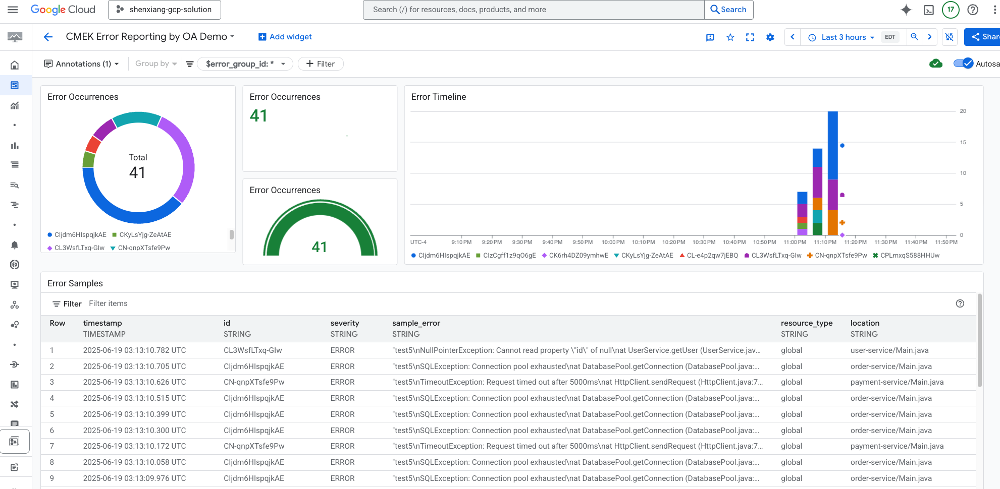

# CMEK Log Bucket Setup and Error Reporting Demo

This repository contains scripts for setting up Cloud Logging buckets with Customer-Managed Encryption Keys (CMEK) in Google Cloud Platform and generating test error logs.

## Table of Contents
- [Overview](#overview)
- [CMEK Log Bucket Scripts](#cmek-log-bucket-scripts)
- [Log Analytics and Routing](#log-analytics-and-routing)
- [Monitoring Dashboard](#monitoring-dashboard)
- [Error Log Generator](#error-log-generator)
- [Prerequisites](#prerequisites)
- [Quick Start](#quick-start)
- [Troubleshooting](#troubleshooting)

## Overview

This project provides:
1. Scripts to create CMEK-encrypted log buckets with log analytics
2. Automatic log routing with exclusions to prevent duplicate storage
3. A Python tool to generate test error logs for Error Reporting

## CMEK Log Bucket Scripts

### 1. `setup_cmek_log_bucket.sh`
Main script for creating a Cloud Logging bucket with CMEK encryption and log analytics.

**Features:**
- Creates a log bucket with CMEK encryption
- Enables log analytics by default (can be disabled with `--no-analytics`)
- Automatically configures IAM permissions for the Logging service account
- Can auto-create KMS resources if they don't exist
- Creates a log sink to route specific logs to the CMEK bucket
- Adds exclusions to the _Default sink to prevent duplicate logs
- Supports updating existing buckets

**Usage:**
```bash
# Basic usage
./setup_cmek_log_bucket.sh \
    --bucket-project PROJECT_ID \
    --kms-project PROJECT_ID \
    --bucket-id BUCKET_ID

# Full example with all options
./setup_cmek_log_bucket.sh \
    --bucket-project my-project \
    --kms-project my-project \
    --bucket-id my-cmek-logs \
    --location us \
    --key-ring logging-cmek-keyring \
    --key-name logging-cmek-key \
    --retention-days 30 \
    --auto-create-kms

# Custom log filter for sink
./setup_cmek_log_bucket.sh \
    --bucket-project my-project \
    --kms-project my-project \
    --bucket-id my-cmek-logs \
    --sink-name custom-sink \
    --log-filter 'severity="ERROR" AND resource.type="gce_instance"'
```

### 2. `setup_cmek_log_bucket_sample.sh`
Sample script with predefined values for quick setup and testing.

```bash
# Uses predefined values for the sample project
./setup_cmek_log_bucket_sample.sh

# Pass additional flags
./setup_cmek_log_bucket_sample.sh --auto-create-kms
```

### 3. `create_kms_resources.sh`
Helper script to create KMS keyring and key if they don't exist.

```bash
./create_kms_resources.sh
```

### 4. `teardown_cmek_log_bucket.sh`
Removes all resources created by the setup script.

**Features:**
- Deletes the log sink
- Removes exclusions from the _Default sink
- Deletes the log bucket
- Removes IAM bindings from the KMS key
- Optionally schedules KMS key for destruction
- Preserves enabled APIs

**Usage:**
```bash
# Basic teardown
./teardown_cmek_log_bucket.sh \
    --bucket-project PROJECT_ID \
    --kms-project PROJECT_ID \
    --bucket-id BUCKET_ID

# Also delete KMS resources
./teardown_cmek_log_bucket.sh \
    --bucket-project my-project \
    --kms-project my-project \
    --bucket-id my-cmek-logs \
    --delete-kms

# Skip confirmation prompts
./teardown_cmek_log_bucket.sh \
    --bucket-project my-project \
    --kms-project my-project \
    --bucket-id my-cmek-logs \
    --force
```

### 5. `teardown_cmek_log_bucket_simple.sh`
Wrapper script for teardown with predefined values.

```bash
# Simple teardown
./teardown_cmek_log_bucket_simple.sh

# With KMS deletion
./teardown_cmek_log_bucket_simple.sh --delete-kms
```

## Log Analytics and Routing

### Log Analytics Feature
When creating a log bucket, log analytics is **enabled by default**. This allows you to:
- Run SQL queries on your logs
- Create custom dashboards and reports
- Perform advanced log analysis

To disable log analytics, use the `--no-analytics` flag.

### Log Sink and Exclusion Feature
The setup script automatically:
1. **Creates a Log Sink** that routes logs matching a filter to the CMEK bucket
2. **Adds an exclusion to the _Default sink** to prevent the same logs from being stored in the _Default bucket

**Default Log Filter:**
```
severity="ERROR" AND jsonPayload.message=~"^test.*"
```

This captures ERROR-level logs where the JSON payload message starts with "test".

### Testing the Configuration
After setup, test your configuration:
```bash
gcloud logging write test-log '{"message": "test error message"}' \
    --payload-type=json \
    --severity=ERROR \
    --project=my-project
```

The logs will appear ONLY in your CMEK bucket, not in the _Default bucket.

## Error Log Generator

### Script: `generate_error_logs.py`

A Python program that generates error log entries following the Google Cloud Error Reporting format.

### Features

Generates ReportedErrorEvent format logs with:
- Simulated stack traces
- Service context
- HTTP request context
- User information
- Error location details

### Installation

1. Start a new virtual environment
   ```bash
   python3 -mvenv venv
   . venv/bin/activate
   ```

2. Install dependencies:
   ```bash
   pip install -r requirements.txt
   ```

3. Set up authentication:
   ```bash
   gcloud auth application-default login
   ```

### Usage

```bash
# Generate 10 error logs (default)
python generate_error_logs.py --prefix "test"

# Generate 20 error logs with a prefix
python generate_error_logs.py --count 20 --prefix "test1"

# Specify project ID explicitly
python generate_error_logs.py --project-id my-project --prefix "test 123"
```

### Command Line Options

- `--project-id`: Google Cloud Project ID (optional, uses default if not specified)
- `--count`: Number of error log entries to generate (default: 10)
- `--prefix`: String to prepend to all error messages

### Error Scenarios Generated

1. **NullPointerException** - User service errors
2. **SQLException** - Database connection issues
3. **TimeoutException** - Request timeout errors

### Viewing the Errors

After running the script, view errors in:

1. **Cloud Logging Console**: 
   ```
   https://console.cloud.google.com/logs
   ```

2. **Error Reporting Console**: 
   ```
   https://console.cloud.google.com/errors
   ```

## Prerequisites

### For CMEK Setup Scripts
- Google Cloud SDK (`gcloud`) installed and configured
- `jq` command-line JSON processor
- Appropriate IAM permissions:
  - `logging.buckets.create` and `logging.buckets.update`
  - `cloudkms.cryptoKeys.create` (if auto-creating KMS resources)
  - `cloudkms.cryptoKeys.setIamPolicy`
  - `logging.settings.get`
  - `logging.sinks.create` and `logging.sinks.update`

### For Error Log Generator
- Python 3.6+
- `google-cloud-logging` library
- Appropriate IAM permissions:
  - `logging.logEntries.create` permission

## Quick Start

1. **Create CMEK-encrypted log bucket with analytics:**
   ```bash
   ./setup_cmek_log_bucket.sh \
       --bucket-project my-project \
       --kms-project my-project \
       --bucket-id my-cmek-logs \
       --auto-create-kms
   ```

2. **Generate test error logs:**
   ```bash
   python generate_error_logs.py --prefix "test123"
   ```

3. **Verify logs are routed correctly:**
   - Check your CMEK bucket for the test logs
   - Verify they don't appear in the _Default bucket

4. **Create the Monitoring Dashboard:**

    After setting up your CMEK log bucket, you can create a monitoring dashboard to visualize error reports:

    ```bash
    # Set environment variables
    export PROJECT_ID="your-gcp-project-id"
    export LOG_BUCKET_ID="your-new-bucket-id"

    # Generate the dashboard JSON with your values
    envsubst < error_report_with_cmek.json > err_rpt.json

    # Import the dashboard to Cloud Monitoring
    gcloud monitoring dashboards create --config-from-file=err_rpt.json
    ```

    This will create a dashboard that displays error reports from your CMEK-encrypted log bucket.

    
4. **Clean up when done:**
   ```bash
   ./teardown_cmek_log_bucket.sh \
       --bucket-project my-project \
       --kms-project my-project \
       --bucket-id my-cmek-logs
   ```

## Troubleshooting

### KMS Key Not Found Error
If you get an error that the KMS key doesn't exist:
1. Run `./create_kms_resources.sh` first, or
2. Use the `--auto-create-kms` flag with the setup script

### Service Account Not Found
The script will automatically trigger service account creation. If this fails:
1. Ensure the Cloud Logging API is enabled
2. Wait a few minutes for the service account to be created
3. Re-run the script

### Permission Errors
Ensure your user account has the necessary IAM roles:
- `roles/logging.admin` for log bucket operations
- `roles/cloudkms.admin` for KMS operations
- `roles/resourcemanager.projectIamAdmin` for IAM bindings

### Authentication Issues
```bash
# Check current authentication
gcloud auth list
gcloud config get-value account

# Re-authenticate if needed
gcloud auth login
gcloud auth application-default login
```

### Errors Not Appearing in Error Reporting
- Ensure the severity is set to ERROR or higher
- Check that log entries follow the correct format
- Wait a few minutes for errors to appear (there can be a delay)

## Notes

- KMS keyrings cannot be deleted once created
- KMS keys have a 24-hour waiting period before permanent deletion
- APIs enabled by the scripts are not disabled during teardown
- Log analytics may incur additional costs based on usage
- The script automatically manages exclusions to prevent duplicate logs
- Error log entries may take a few minutes to appear in Error Reporting

## Command-Line Options Reference

### setup_cmek_log_bucket.sh
- `--bucket-project` - Project ID for the log bucket
- `--kms-project` - Project ID for the KMS key
- `--bucket-id` - Name for the log bucket
- `--location` - Location for resources (default: us)
- `--key-ring` - KMS key ring name
- `--key-name` - KMS key name
- `--retention-days` - Log retention period
- `--auto-create-kms` - Auto-create KMS resources if missing
- `--no-analytics` - Disable log analytics
- `--sink-name` - Name for the log sink (default: BUCKET_ID-sink)
- `--log-filter` - Filter for logs to route

### teardown_cmek_log_bucket.sh
- `--bucket-project` - Project ID where the bucket exists
- `--kms-project` - Project ID where the KMS key exists
- `--bucket-id` - Name of the bucket to delete
- `--location` - Location of resources
- `--key-ring` - KMS key ring name
- `--key-name` - KMS key name
- `--sink-name` - Name of the sink to delete
- `--delete-kms` - Also delete KMS resources
- `--force` - Skip confirmation prompts
